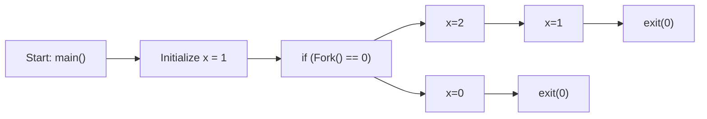

---
# You can also start simply with 'default'
theme: academic
# random image from a curated Unsplash collection by Anthony
# like them? see https://unsplash.com/collections/94734566/slidev
# background: https://cover.sli.dev
highlighter: shiki
# some information about your slides (markdown enabled)
title: 08-EOF
info: |
  ICS 2024 Fall Slides
  Presented by Arthals
titleTemplate: '%s'
# apply unocss classes to the current slide
class: text-center
# https://sli.dev/features/drawing
drawings:
  persist: false
# slide transition: https://sli.dev/guide/animations.html#slide-transitions
transition: fade-out
# enable MDC Syntax: https://sli.dev/features/mdc
mdc: true
layout: cover
coverBackgroundUrl: /08-EOF/cover.jpg
---

# 异常控制流 {.font-bold}

2110306206 预防医学&信双 卓致用{.!text-gray-200}

<div class="pt-12  text-gray-1">
  <span @click="$slidev.nav.next" class="px-2 py-1 rounded cursor-pointer" hover="bg-white bg-opacity-10">
    Here we go! <carbon:arrow-right class="inline"/>
  </span>
</div>

<style>
  div{
   @apply text-gray-2;
  }
</style>

---

# 控制流

Control Flow

控制流：直观理解就是一条条指令的执行顺序。

处理器读取并执行一串指令序列，程序计数器产生一串相应的序列：$a_0,a_1,\cdots$

每次从 $a_k$ 到 $a_{k+1}$ 的过渡称为 **控制转移**。

---

# 控制转移

Control Transfer

常见：跳转、分支、调用、返回（对程序状态的变化做出反应）

但是，如何对系统状态的变化做出反应？

比如：`Ctrl+C`、请求磁盘、处理异常...

---

# 异常控制流

Exceptional Control Flow

定义：程序执行过程中遇到特殊事件或条件时，改变正常指令执行顺序的机制，它发生在计算机系统的各个层次。

包括：

- 异常
- 进程控制
- 信号
- 非本地跳转

---

# 异常

Exception

异常：控制流的突变。发生异常时，控制流会转移至 **操作系统内核**{.text-sky-5} 以响应某些事件（处理器状态的变化）。

内核：操作系统常驻内存的部分，负责管理计算机硬件和软件资源。

异常处理类似于过程调用，但有区别：

| Diff | 过程调用 | 异常 |
| --- | --- | --- |
| 返回位置 | 返回地址 | 当前指令 $I_{cur}$ / 下一条指令 $I_{next}$ |
| 跳转准备 | 压栈相关信息 | 压栈相关信息，但会额外压栈一些内容 |
| 运行模式 | 用户态 | 内核态 |

---

# 异常的类别

Exception Categories

异常可以分为四类：中断、陷阱、故障、终止。

<div class="text-sm">

| 类别   | 原因                     | 异步 / 同步 | 返回行为               |
|--------|--------------------------|-----------|------------------------|
| 中断（Interrupt）   | 来自 I/O 设备的信号      | 异步  | 总是返回到下一条指令 $I_{next}$   |
| 陷阱（Trap）   | 有意的异常               | 同步      | 总是返回到下一条指令 $I_{next}$   |
| 故障（Fault）   | 潜在可恢复的错误         | 同步      | 可能返回到当前指令 $I_{cur}$     |
| 终止（Abort）   | 不可恢复的错误           | 同步      | 不会返回               |

</div>

<br>

- **异步异常**：是由处理器外部的 I/O 设备中的事件产生的
- **同步异常**：是一条指令的直接产物

辨析：异步异常和当前控制流无关，是来自“外界”的；同步异常和当前控制流有关，是源自当前指令。


---

# 中断

Interrupt

<div grid="~ cols-2 gap-12">
<div>

类型：异步（来自外部）

返回行为：总是返回到下一条指令 $I_{next}$

常见：I / O 设备（磁盘读取完成）、定时器（周期性定时器中断）

</div>

<div>

{.mx-auto}

</div>
</div>

直观理解：

<v-clicks>

1. 你正在写作业，突然你父母（不是你自己写着写着发现的）叫你吃饭（异步）
2. 你得到消息后停笔，但是已经写完的东西不需要再写（$I_{cur}$）
3. 等你吃完饭回来后，你再从写完的字的下一个字开始接着写（$I_{next}$）

</v-clicks>

---

# 陷阱、系统调用

Trap & System Call

<div grid="~ cols-2 gap-12">
<div>

类型：同步（源自当前指令），陷阱是 **故意的异常**{.text-sky-5}

返回行为：总是返回到下一条指令 $I_{next}$

常见：系统调用，如 `write` `read` 等涉及文件 I / O 的指令，`fork` 等涉及进程控制的指令。

</div>

<div>

{.mx-auto}

</div>
</div>


直观理解：

<v-clicks>

1. 你正在写作文，突然你意识到需要引用一段名人名言（同步，故意的）
2. 你停笔去查谷歌，但是已经写完的字不需要再写（$I_{cur}$）
3. 查完书回来后，你再从写完的字的下一个字开始接着写（$I_{next}$）

</v-clicks>

---

# 故障

Fault

<div grid="~ cols-2 gap-12">
<div>

类型：同步（源自当前指令），故障是 **潜在可恢复的错误**{.text-sky-5}

返回行为：可能返回到当前指令 $I_{cur}$

常见：缺页故障

</div>

<div>

{.mx-auto}

</div>
</div>

直观理解：

<v-clicks>

1. 你正在写作业，突然你发现自己写错了一段话（$I_{cur}$ 导致了故障）
2. 你停笔找修正带，但是有可能找不到（尝试运行故障处理程序）
3. 如果你能找到，你可以用修正带修正后重新写（$I_{cur}$）
4. 如果找不到，你只能终止这次写作业（`abort`），出门看看能不能买到修正带，或者干脆开摆

</v-clicks> 

---

# 终止

Abort

类型：同步，终止是 **不可恢复的错误**{.text-sky-5}

返回行为：不会返回

常见：非法操作、地址越界、算术溢出、除零错误、硬件错误

<br>

直观理解：

<v-clicks>

1. 你正在写作业，突然发现你写错题了
2. 直接不写这道题了，拜拜了您内

</v-clicks>

---

# 常见的异常

Common Exceptions

{.mx-auto}

- 中断：外部 I / O 设备
- 陷阱（同步）：故意引发的异常，目的是进行系统调用
- 故障（同步）：出错了，有可能修复。例：**缺页**{.text-sky-5}、除法错误、**一般保护故障（段错误）**{.text-sky-5}
- 终止（同步）：致命错误，无法恢复。例：DRAM/SRAM 损坏

---

# 系统调用

System Call

在 x86-64 系统上，系统调用是通过一条称为 `syscall` 的陷阱指令来提供的。

所有 Linux 系统调用的参数都是通过 **通用寄存器**{.text-sky-5} 而不是栈传递的。具体如下：

- 系统调用号：寄存器 `%rax`，**每个系统调用有唯一的整数号**{.text-sky-5}
- 参数寄存器：`%rdi` `%rsi` `%rdx` `%r10` `%r8` `%r9`<br><span class="text-sm text-gray-5">（注意和过程调用有出入，第 4 个参数是 `%r10`，而不是过程调用中的 `%rcx`，[回顾](https://slide.huh.moe/02/13)）</span>

从系统调用返回时，寄存器 `%rcx` 和 `%r11` 都会被破坏，`%rax` 包含返回值 `errno`。

<div class="text-sm text-gray-5">

`errno`：Error Number，错误码，全局变量，存储最近一次系统调用失败的原因。

</div>

返回值在 $-4095$ 到 $-1$ 之间的负数表示发生了错误，对应于负的 `errno`。

---

# 系统调用

System Call

{.mx-auto.h-50}

<div grid="~ cols-2 gap-12">
<div>


```c{all|3-4|5-6}{at:1}
int main()
{
    // 写入 "hello, world\n"
    write(1, "hello, world\n", 13);
    // 退出程序，返回代码为 0
    _exit(0);
}
```

</div>

<div>


```asm{all|9-15|16-20}{maxHeight:'150px',at:1}
.section .data
string:
    .ascii "hello, world\n"    // 字符串 "hello, world\n"
string_end:
    .equ len, string_end - string // 计算字符串长度
.section .text
.globl main
main:
    // 首先，调用 write(1, "hello, world\n", 13)
    movq $1, %rax     // write 是系统调用 1
    movq $1, %rdi     // 参数1：stdout 的描述符是 1
    movq $string, %rsi  // 参数2：hello world 字符串
    movq $len, %rdx    // 参数3：字符串长度
    syscall          // 发起系统调用

    // 然后，调用 _exit(0)
    movq $60, %rax    // _exit 是系统调用 60
    movq $0, %rdi     // 参数1：退出状态码为 0
    syscall          // 发起系统调用
```


</div>
</div>

---

# 进程

Process

假象：好像我们在跑的程序是系统中唯一运行的程序，**独占 CPU 和内存**{.text-sky-5}（然而 `top` 一下很容易打假）

1. **独立的逻辑控制流**：好像我们的程序独占地使用处理器（实际上由 **上下文切换** 的机制实现）
2. **私有的地址空间**：好像我们的程序独占地使用内存（实际上由 **虚拟内存** 机制实现）

**进程（Process）**：一个 **执行中程序的实例**{.text-sky-5}，系统中的每个程序都运行在某个进程的上下文中。

上下文（Context）：直观理解就是程序运行时所需的各种状态信息。

<div class="text-sm">

- 程序的代码和数据
- 栈
- 通用目的寄存器的内容
- 程序计数器
- 环境变量
- 打开文件描述符的集合

</div>

<!-- 

理解上下文：阅读理解题

 -->

---

# 并发流

Concurrent Flow

<div grid="~ cols-3 gap-6">
<div col-span-2>

**并发流**：一个逻辑流的执行在时间上与另一个流重叠。

也即：`A 的开始 ~ A 的结束` 与 `B 的开始 ~ B 的结束` 在时间上重叠。


右图中，从 A 到 B，发生了 **抢占（Preemption）、中断（Interrupt）、上下文切换（Context Switch）**{.text-sky-5}

### 鉴别{.mt-6}

**并行**：同一时刻，多个进程在不同核上运行，并行是并发的真子集。

</div>

<div>


{.mx-auto}

</div>
</div>

---

<div grid="~ cols-2 gap-12" h-full>
<div>

# 私有地址空间

Private Address Space

- **用户区**：地址 $\text{0x400000 }(2^{22}) \sim 2^{48} - 1$
- **内核区**：地址 $\geq 2^{48}$

<span class="text-sm text-gray-5">

[回顾](https://slide.huh.moe/07/31)

实际上，并没有真的分配这么多（假象，用到的很稀疏），而是通过 **虚拟内存映射** 实现的。

</span>

</div>

<div flex="~ col items-center justify-center" h-full>

{.mx-auto}

</div>
</div>

---

# 用户模式 vs 内核模式

User Mode vs Kernel Mode

| 比较项 | 用户模式 | 内核模式 |
| --- | --- | --- |
| 模式位 | 0 | 1 |
| 权限 | 受限 | 不受限 |
| 访存 | 仅限用户区 \* | 任意地址 |
| 特权指令 \*\* | 不能执行 | 可以执行 |

<div class="text-sm text-gray-5">

\* 直接引用地址空间中内核区内的代码和数据会导致保护故障（Abort），但是可以通过 `/proc` 文件系统访问一部分内核数据结构的内容。

\*\* 特权指令：修改模式位、**执行 I/O 操作**{.text-sky-5}、改变内存中的指令流。

</div>

---

# 上下文切换

Context Switch

**定义**：上下文切换是内核 **重新启动一个被抢占的进程**{.text-sky-5} 所需的 **进程状态**（context）的转换。

1. 保存当前进程的上下文
2. 恢复下一个进程的上下文
3. 将控制权转交给新进程

上下文：用户栈、状态寄存器、内核栈和各种内核数据结构（内存结构的页表、进程表、已打开文件的文件表）

**调度**：内核决定抢占当前进程，并决定哪个进程来重新开始。


### 例子{.mb-2.mt-8}

- **DMA传输**：进程切换等待磁盘数据传输
- **无阻塞系统调用**：内核决定执行上下文切换，而不是返回用户态
- **中断**：周期性定时器中断（ 1ms / 10ms ）

---

# 上下文切换

Context Switch

{.mx-auto.h-60}

<div class="text-sm">

<v-clicks>

1. **磁盘中断**：进程 A 在执行 `read` 操作时，由于 `read` 是特权指令，系统调用陷入内核态（陷阱）
2. **上下文切换**：内核处理系统调用，知道要等很久（DMA 直接内存访问），于是决定不返回到 A，而是切换到 B（抢占、调度）
3. **中断处理程序（handler）**：B 正在运行，来了磁盘中断，告知内核数据已经拿到了，于是进程 B 需要处理中断，进入中断处理程序（内核态）
4. **调度**：中断处理过程中，内核知道 A 数据等到了，于是决定切换回 A
5. **继续执行**：控制流回到 A，A 继续执行

</v-clicks>

</div>

---

# 系统调用错误处理

System Call Error Handling

当 Unix **系统级函数遇到错误** 时，它们通常会 **返回 `-1`，并设置全局整数变量 `errno`**{.text-sky-5} 来表示什么出错了。

```c
if ((pid = fork()) < 0) {
    fprintf(stderr, "fork error: %s\n", strerror(errno)); // fprintf 输出到标准错误流，strerror 返回错误描述的文本串
    exit(0);
}
```

继续包装，以首字母是否大写指示是否是包装过的函数：

<div grid="~ cols-2 gap-12">
<div>

```c
void unix_error(char *msg) { // unix 风格的错误处理
    // errno 是全局变量，不需要传参
    fprintf(stderr, "%s: %s\n", msg, strerror(errno));
    exit(0);
}
if ((pid = fork()) < 0) {
    unix_error("fork error");
}
```

</div>

<div>

```c
pid_t Fork(void) {
    pid_t pid;
    if ((pid = fork()) < 0) {
        unix_error("Fork error");
    }
    return pid;
}
pid = Fork();
```

</div>
</div>

---

# 进程控制 - 进程 ID

Process ID

每个进程都有 **唯一的正数进程 ID（PID）**{.text-sky-5} 

<span class="text-sm text-gray-5">试试在 clab 上执行 `ps -ef | head -n 5`！（`ps` 是 process status，`-e` 是所有进程，`-f` 是完整格式）</span>


- `getpid`（get process ID）返回调用进程的 PID
- `getppid` （get parent process ID）返回它的父进程的 PID

两个函数返回类型为 `pid_t` 的整数值，在 Linux 系统上它在 `types.h` 中被定义为 `int`。

```c
#include <sys/types.h> // 定义 pid_t
#include <unistd.h>    // 定义 getpid 和 getppid
pid_t getpid(void);
pid_t getppid(void);
```

<div v-click>

```bash
UID          PID    PPID  C STIME TTY          TIME CMD
root           1       0  0 Nov08 ?        00:01:28 /sbin/init
root           2       0  0 Nov08 ?        00:00:00 [kthreadd]
root           3       2  0 Nov08 ?        00:00:00 [pool_workqueue_release]
root           4       2  0 Nov08 ?        00:00:00 [kworker/R-rcu_g]
```

</div>

---

# 进程控制 - 创建 / 终止

Process Creation / Termination

同一时刻，操作系统中有若干个进程，每个进程都属于三种状态之一：

<div grid="~ cols-2 gap-12" text-sm>
<div>


1. **运行**{.text-sky-5}
    - 同一时间可以有若干个进程同时运行
    - 运行 ≠ 正在 CPU 上执行（调度机制，可能是在等待调度的队列中）
2. **停止**{.text-sky-5}
    - 进程被挂起，且 **不会** 进入等待调度的队列
    - 收到以下 4 种信号会导致进程停止：
        - `SIGSTOP`<span class="text-xs text-gray-5">（Signal Stop）</span>
        - `SIGTSTP`<span class="text-xs text-gray-5">（Signal Terminal Stop）</span>
        - `SIGTTIN`<span class="text-xs text-gray-5">（Signal Terminal/TTY Input for Background Process）</span>
        - `SIGTTOU`<span class="text-xs text-gray-5">（Signal Terminal/TTY Output for Background Process）</span>
    - 收到 `SIGCONT` <span class="text-xs text-gray-5">（Signal Continue）</span> 后被转为运行状态

</div>

<div>

3. **终止**{.text-sky-5}
    - 进程永不运行，不能被转为运行状态
    - 可能原因：
        1. 收到相关信号
        2. 从主程序返回，返回的整数值会被设为进程的退出状态，非 0 表示异常退出
        3. 调用 `exit` 函数，`int exit(int status)`
    - 一个进程终止后必须被回收，否则会变成僵尸进程（Zombie Process）

<div class="text-xs">

一些说明：

1. TTY 是 Teletypewriter 的缩写，是电传打字机，是早期的计算机外设，用于连接计算机和终端，现在一般指终端。
2. 在后台的进程若想从终端读取输入/写入输出时，进程会停止，直到他们转为前台进程。这是为了确保终端的输入只被前台进程使用。

</div>


</div>
</div>

---

# 进程控制 - 分叉

Process Fork

`fork` 函数创建一个新进程，新进程是调用进程的副本。

原进程称为 **父进程**，新的进程称为 **子进程**。

此时两个进程完全相同：相同但独立的地址空间，堆栈，变量值，代码，打开的文件：


{.mx-auto.h-70}


---

# 进程控制 - 分叉

Process Fork

<div grid="~ cols-2 gap-12">
<div>


父进程可以调用 `fork` 函数创建新的子进程，它们是 **并发的独立进程**{.text-sky-5}。

`fork` 函数调用一次，返回 2 次：

- 一次返回在父进程中，返回值为 **子进程的 PID**
- 一次返回在子进程中，返回值为 **0**

因为子进程 PID 总非零，可以以此区别父子进程。

父子进程最大的区别就是 PID 不同。

</div>

<div>

```c
int main(){
    pid_t pid;
    int x = 1;
    pid = Fork();
    if(pid == 0){
        /*Child */ 
        printf("child: x=%d\n",++x);
        exit(0); // 子进程退出，不会继续执行后续代码
    }
    /* Parent */
    printf("parent: x=%d\n",--x);
    exit(0); // 父进程退出
}
```

```c
pid = Fork();
if (pid == 0){ // 子进程
  // do something
} else { // 父进程
  // do something
}
```

</div>
</div>

---

# 进程控制 - 分叉

Process Fork

<div grid="~ cols-2 gap-12">
<div>

```c
int main()
{
    int x = 1;

    if (Fork() == 0)
        printf("p1: x=%d\n", ++x);
    printf("p2: x=%d\n", --x);
    exit(0);
}
```

</div>

<div text-sm>

考点：`printf` 有缓冲区，且 `fork` 后，子进程会具有父进程缓冲区的副本，但是后续再写入缓冲区时，父子进程彼此独立。

清空缓冲区：

- `fflush(stdout)` `scanf()`
- `printf` 遇到换行符 `\n`、回车符 `\r` 会清空缓冲区
- 进程退出时会清空缓冲区

</div>
</div>

<br>



拓扑排序：不违逆这张图中的箭头方向。

---

# 进程控制 - 分叉

Process Fork

{.mx-auto.h-100}

---

# 进程控制 - 分叉

Process Fork

<div grid="~ cols-2 gap-12">
<div>


{.mx-auto}

</div>

<div v-click>


{.mx-auto}

</div>
</div>


---

# 进程控制 - 回收子进程

Process Reaping

一个进程终止后必须被其父进程回收。

如果父进程已终止，则安排 `init` 进程作为养父。

`init` 进程：`pid=1`, 系统启动由内核创建的第一个进程，所有的进程都是它衍生出来的。

```c
#include <sys/wait.h>
int waitpid(pid_t pid, int *statusp, int options);
```

`waitpid()` 函数：父进程调用 `waitpid()` 等待其子进程终止。

<div class="text-sm">

- `pid`：表明等待集合包含哪个/哪些子进程
- `statusp`：status pointer，若放入一个指针，则 `waitpid` 返回后会把子进程的相关状态信息存储在该指针指向的位置 \*
- `options`：修改等待的具体行为

\* C 中有很多类似的函数，不通过返回值传递结果，而是通过传递指针参数，然后再在过程中将结果写入指针指向的内存。要习惯这种用法。

</div>

---

# waitpid 函数详解

`waitpid()` Function

### 等待集合 `pid`

<div class="mt-2"/>

- `pid > 0`：等待集合包含进程 ID 为 `pid` 的子进程
- `pid = -1`：等待集合包含父进程的所有子进程

---

# waitpid 函数详解

`waitpid()` Function

### 选项 `options`

`options` 是基于位向量实现的，所以可以使用 `|` 来组合多个选项。 <span class="text-sm text-gray-5">`0001 | 0010 = 0011`</span>

- `WNOHANG`：wait no hang，如果等待集合中没有子进程 **终止**{.text-sky-5}，则 **立即返回 0**{.text-sky-5}
- `WUNTRACED`：wait untraced，**挂起**{.text-sky-5} 调用进程，等待集合中任一子进程 **终止或停止**{.text-sky-5}
- `WCONTINUED`：wait continued，**挂起**{.text-sky-5} 调用进程，等待集合中任一子进程 **继续**{.text-sky-5}

默认行为：`waitpid(-1, NULL, 0)`，**挂起**{.text-sky-5} 调用进程，等待集合中任一子进程 **终止**{.text-sky-5}

组合例子：`WNOHANG | WUNTRACED`：

<v-clicks>

1. 首先必然立即返回 `WNOHANG`
2. 其次对于子进程的要求是终止或停止 `WUNTRACED`
3. 所以，若无子进程满足条件，则返回 0，否则返回子进程的 PID

</v-clicks>

---

# waitpid 函数详解

`waitpid()` Function

### 状态信息 `statusp`

`statusp` 允许留空，若非空则要求其是一个指针，指向一个整数。

`waitpid` 返回后会把子进程的相关状态信息存储在该指针指向的内存中。

你可以用 **宏** 来解析 `statusp` 指向的内存中的状态信息。

<div class="text-sm">

<v-clicks>

- `WIFEXITED(status)`：如果子进程通过调用 `exit` 或者一个返回（`return`）正常终止，就返回真。
- `WEXITSTATUS(status)`：返回一个 **正常终止** 的子进程的退出状态。只有在 `WIFEXITED()` 返回为真时，才定义这个状态。
- `WIFSIGNALED(status)`：如果子进程是因为一个 **未被捕获的信号** 终止的，那么就返回真。
- `WTERMSIG(status)`：返回 **导致子进程终止** 的信号的编号。只有在 `WIFSIGNALED()` 返回为真时，才定义这个状态。
- `WIFSTOPPED(status)`：如果引起返回的子进程当前是 **停止** 的，那么就返回真。
- `WSTOPSIG(status)`：返回引起子进程 **停止** 的信号的编号。只有在 `WIFSTOPPED()` 返回为真时，才定义这个状态。
- `WIFCONTINUED(status)`：如果子进程 **收到 `SIGCONT` 信号重新启动**，则返回真。

</v-clicks>

</div>

---

# waitpid 函数详解

`waitpid()` Function

如果调用进程没有子进程，那么 `waitpid` 返回 `-1`，并且设置 `errno` 为 `ECHILD`（Error Child）。

如果 `waitpid` 函数被一个信号中断，那么它返回 `-1`，并设置 `errno` 为 `EINTR`（Error Interrupt）。

### `wait()`

简化版本的 `waitpid`。

```c
pid_t wait(int *statusp);
```

只接受一个参数，等价于 `waitpid(-1, statusp, 0)`

---

# 进程控制 - 回收子进程

Process Reaping

<div grid="~ cols-3 gap-6">
<div>

### 回收的乱序性

**程序不会按照特定的顺序回收子进程。**

如何顺序回收：指定 `waitpid` 的 `pid` 参数。

</div>

<div col-span-2>

```c{all|9-12|14-20}{maxHeight:'400px'}
#include "csapp.h"
#define N 2

int main()
{
    int status, i;
    pid_t pid;

    /* 父进程创建 N 个子进程 */
    for (i = 0; i < N; i++)
        if ((pid = Fork()) == 0) /* 子进程 */
            exit(100 + i);

    /* 父进程以任意顺序回收 N 个子进程 */
    while ((pid = waitpid(-1, &status, 0)) > 0) {
        if (WIFEXITED(status))
            printf("子进程 %d 正常终止，退出状态=%d\n", pid, WEXITSTATUS(status));
        else
            printf("子进程 %d 异常终止\n", pid);
    }

    /* 唯一的正常终止是没有更多的子进程 */
    if (errno != ECHILD) /* EINTR */
        unix_error("waitpid 错误");

    exit(0);
}
```

</div>
</div>


---

# 进程控制 - waitpid 函数

`waitpid` Function

{.mx-auto}

注意：默认行为下，使用 `waitpid` `wait` 会 **挂起** 调用进程，直到子进程终止。

这会使得拓扑排序的可能性受限。

---

# 进程控制 - 休眠

`sleep` & `pause`

<div grid="~ cols-2 gap-8">
<div>

`sleep`：将一个进程挂起一段指定的时间。

```c
#include <unistd.h>

unsigned int sleep(unsigned int secs);
```
返回：还要休眠的秒数。

- 如果请求的时间量已经到了，`sleep` 返回 `0`
- 否则返回还剩下的要休眠的秒数（当 `sleep` 函数被一个信号中断而提前返回）

</div>

<div>

`pause`：让调用进程休眠，直到该进程收到一个信号。

```c
#include <unistd.h>

int pause(void);
```

总是返回 `-1`。


</div>
</div>

---

# 进程控制 - 新建进程

`execve` Function

`execve`：execute vector environment，在当前进程的上下文中加载并运行一个新程序。

```c
#include <unistd.h>
int execve(const char *filename, const char *argv[], const char *envp[]);
```

- `filename`：执行的目标文件名
- `argv`：参数列表数组，每个指针指向一个参数字符串
- `envp`：环境变量数组，每个指针指向一个环境变量字符串

**返回值**：

- 成功：不返回
- 失败：返回 -1，并设置 `errno`

如果找不到 `filename`，函数返回到调用程序，否则函数调用一次并且从不返回。


---

# 参数列表和环境变量

Argument & Environment

对于一个指令：

```bash
LD_PRELOAD=/usr/lib/libkdebug.so ls -l /usr/include
```

<div grid="~ cols-2 gap-12" mt-4>
<div>

### 参数列表

参数：传递给新程序的参数。

```c
argv[0] -> "ls" // 可执行文件名
argv[1] -> "-l" // 参数 1
argv[2] -> "/usr/include" // 参数 2
argv[3] -> NULL
```

</div>

<div>

### 环境变量

环境变量：`key=value` 的键值对。

```c
envp[0] -> "LD_PRELOAD=/usr/lib/libkdebug.so"
envp[1] -> NULL
```

</div>
</div>

---

# 进程控制 - 新建进程

`execve` Function

调用 `execve` 后，程序会执行新的主函数，格式如下：

```c
int main(int argc, char **argv, char **envp); // 注意，是 char ** 指针
```

<div grid="~ cols-2 gap-12">
<div text-sm>

- `argc`：参数个数，argument count
- `argv`：参数列表指针数组，argument vector
- `envp`：环境变量数组指针，environments array pointer

{.mx-auto.h-60}

</div>

<div>

{.mx-auto}

</div>
</div>

---

# 信号

Signals

信号：是一种用于通知进程（运行中的程序）发生了某些事件的机制。（书上定义：一条小消息）

你可以把信号想象成一种 “提醒” 或 “通知”，它会告诉进程某些事情发生了，需要做出反应。

- 发送者：内核（检测到事件） / 进程（调用 `kill` 函数）
- 接收者：进程（行为：忽略、终止、捕获并调用信号处理函数）

<br>

<div grid="~ cols-2 gap-12">
<div>

> 当你按下键盘上的 `Ctrl+C` 组合键时，操作系统会发送一个特定的信号（通常是 `SIGINT` 信号）给正在运行的程序，通知它应该停止运行。
>
> 程序可以选择如何处理这个信号，比如立即停止，或者进行某些清理工作后再停止。

</div>

<div text-sm>

{.mx-auto}

调用结束后，若返回控制流给进程，则继续运行 $I_{next}$

</div>
</div>

---

# 常见信号

Common Signals

<div class="text-sm">

| 信号     | 信号全称                      | 默认行为           | 相关事件                        |
|----------|-------------------------------|--------------------|---------------------------------|
| `SIGINT`   | Interrupt Signal              | 终止               | 来自键盘的中断（Ctrl-C）        |
| `SIGILL`   | Illegal Instruction Signal    | 终止并转储内存     | 非法指令                        |
| `SIGFPE`   | Floating Point Exception      | 终止并转储内存     | 浮点异常                        |
| `SIGKILL`  | Kill Signal                   | 终止               | 杀死进程                        |
| `SIGSEGV`  | Segmentation Fault Signal     | 终止并转储内存     | 无效的内存引用（段故障）        |
| `SIGUSR1`  | User-defined Signal 1         | 终止               | 用户定义的信号 1                 |
| `SIGUSR2`  | User-defined Signal 2         | 终止               | 用户定义的信号 2                 |


</div>


---

# 常见信号

Common Signals

<div class="text-sm">

| 信号     | 信号全称                      | 默认行为           | 相关事件                        |
|----------|-------------------------------|--------------------|---------------------------------|
| `SIGALRM`  | Alarm Clock Signal            | 终止               | 来自 `alarm` 函数的定时器信号       |
| `SIGCHLD`  | Child Status Changed Signal   | 忽略               | 一个子进程停止或终止            |
| `SIGCONT`  | Continue Signal               | 继续执行           | 继续进程，如果该进程停止         |
| `SIGSTOP`  | Stop Signal                   | 停止直到下一个SIGCONT | 不是来自终端的停止信号         |
| `SIGTSTP`  | Terminal Stop Signal          | 停止直到下一个SIGCONT | 来自终端的停止信号（Ctrl-Z）  |


</div>

重点：**`SIGKILL` 和 `SIGSTOP` 无法被捕获、忽略。**{.text-sky-5}

这意味着它们的行为是由操作系统内核直接处理的，不依赖于用户空间的代码（反例：`SIGINT` `SIGTSTP`）。

这确保了系统管理员和操作系统能够在必要时强制控制进程的状态，而不受进程本身的干扰。

<!-- 

Bomblab SIGINT

 -->

---

# 待处理信号

Pending Signals

**待处理信号**：进程在排队等候运行时，发送给它的信号不能马上被处理。

实现：名为 `pending` 的位向量（每个进程都有独属于自己的一个）

- 当信号被传送到进程，那么 `pending` 位向量中对应位置的值会被置为 1
- 当信号在对应进程得到接收时，`pending` 位向量中对应位置的值会被重置为 0

所以，**进程只能知道”自己收到过某类信号”，但不能知道总共收到了几次**{.text-sky-5}

<div class="text-sm" mt-4>

<v-clicks>

1. （单核）操作系统中，多个进程轮流运行在 CPU 上
2. 如果进程 a 正在 CPU 上运行，则马上能收到信号并处理
3. 如果进程 a 在排队等候运行，则发给 a 的信号不能马上被处理，那么这个信号就称之为待处理信号，会保存在进程 a 的一个叫做 **`pending` 的位向量**{.text-sky-5} 中
4. 位向量：每一位对应一个信号，只有 0 和 1 两种状态，0 表示未收到此信号，1 表示收到此信号
5. 轮到 a 在 CPU 上运行时，它才能开始处理这些待处理信号
6. 但是，这时可能 a 已经收到了一堆待处理信号

</v-clicks>

</div>

---

# 阻塞信号

Blocked Signals

**阻塞信号**：进程可以阻塞某些信号，使其不能被处理。

实现：名为 `blocked` 的位向量（每个进程都有独属于自己的一个）

进程可以有选择性地阻塞接收某种信号。

当一种信号被阻塞时，它仍可以被发送，**但是产生的待处理信号不会被接收，直到进程取消对这种信号的阻塞。**{.text-sky-5}


---

# 进程和进程组

Process & Process Group

**进程组（process group）**：一个或多个进程的集合，它们共享一个共同的进程组 ID。

进程可以通过 `setpgid` 函数改变 **自己 / 其他** 进程的进程组。

---

# 作业

Jobs

**作业（job）**：一个或多个进程的集合，通常由一个前台进程和若干后台进程组成，通常由 shell 创建和管理。

一个作业可以包含一个单独的命令或一组通过管道连接的命令，作业可以在前台运行，也可以在后台运行。

<div grid="~ cols-2 gap-12">
<div class="text-sm">

**前台（foreground）**：前台作业是当前在终端中运行的作业。

- 前台作业会占用终端，并且可以从用户那里接受输入。
- 一个后台作业通过 `fg` 命令转换为前台作业。

**后台（background）**：后台作业是在终端中启动但不占用终端的作业。

- 后台作业可以在不与用户交互的情况下运行，用户可以继续在终端中执行其他命令。
- 后台作业通常通过在命令后面加上 `&` 符号来启动，也可以通过 `bg` 命令来启动。

</div>

<div>

{.mx-auto}

</div>
</div>


---

# 发送信号

Send Signals

<div grid="~ cols-2 gap-12" text-sm>
<div>

### `/bin/kill` 程序

```bash
/bin/kill -signal pid
/bin/kill -9 15213 
```

发送信号 `SIGKILL` 给进程 15213，杀死它

</div>

<div>

### `kill` 函数

```c
int kill(pid_t pid, int sig);
```
<div mt-4/>

- 如果 `pid > 0`，则将信号 `sig` 发送给进程 ID 为 `pid` 的进程
- 如果 `pid == 0`，则将信号 `sig` 发送给与调用 `kill` 的进程属于同一个进程组的所有进程
- 如果 `pid == -1`，则将信号 `sig` 发送进程组 `|pid|` 内的所有进程

返回值：

- 成功：0
- 失败：-1

</div>
</div>

---

# 发送信号

Send Signals

<div grid="~ cols-2 gap-12" text-sm>

<div>

### 从键盘发送信号

发送信号到 **前台进程组** 中的每个进程

<kbd>Ctrl+C</kbd> 发送 `SIGINT` 信号，终止前台进程

<kbd>Ctrl+Z</kbd> 发送 `SIGTSTP` 信号，挂起前台进程

<kbd>Ctrl+D</kbd> 发送 `EOF` 信号，指示输入结束


</div>

<div>

### `alarm` 函数

设置一个定时器，在指定的秒数后发送 `SIGALRM` 信号给当前进程


```c
#include <unistd.h>
unsigned int alarm(unsigned int secs);
```

对 `alarm` 的调用都将取消任何待处理的（pending）闹钟。

返回值：

- 如果之前有定时器，返回剩余时间
- 如果之前没有定时器，返回 0


</div>
</div>

---

# 接收信号

Receive Signals

接收时刻：内核把进程 p 从 **内核模式** 切换到 **用户模式** 时，在执行代码前处理信号。

接收信号类型：`pending & ~blocked`，若非空，强制进程接收其中之一。

进程会采取前文所述三种行为之一（忽略、终止、捕获并调用信号处理函数），处理完毕后，继续选择其他信号接收，直到集合为空后，才将控制转移回进程 p 的逻辑控制流的下一条指令 $I_{next}$。

---

# 接收信号

Receive Signals

信号的默认行为 [回顾](https://slide.huh.moe/08/40)：

- 进程终止，如 `SIGINT` `SIGKILL`
- 进程终止并转储内存，如 `SIGILL` `SIGFPE` `SIGSEGV`
- 进程停止（挂起），直到被 `SIGCONT` 信号重新启动，如 `SIGSTOP` `SIGTSTP`
- 忽略该信号，如 `SIGCHLD`

---

# signal 函数

`signal` Function

我们可以使用 `signal` 函数修改信号的处理行为：

```c
#include <signal.h>
typedef void (*sighandler_t)(int); // 函数指针类型

sighandler_t signal(int signum, sighandler_t handler);
```

参数 `handler` 可以有三种情况（前两种都是宏）：

- `SIG_IGN`：忽略信号
- `SIG_DFL`：采用默认行为
- 用户自定义的函数地址

---

# 信号处理函数

Signal Handler

```c
// Bomblab/support.c
#include <signal.h>
static void sig_handler(int sig)
{
    printf("So you think you can stop the bomb with ctrl-c, do you?\n");
    sleep(3);
    printf("Well...");
    fflush(stdout);
    sleep(1);
    printf("OK. :-)\n");
    exit(16);
}
signal(SIGINT, sig_handler);
```

这个函数会做什么？

---

# 信号处理函数

Signal Handler

**信号处理程序可以被其他信号处理程序中断**{.text-sky-5}

{.mx-auto.h-60}

信号处理程序是用户态的一部分，当信号处理程序捕获信号 t 并处理时，它是在用户态运行的。

---

# 阻塞 / 解除阻塞信号

Blocked / Unblocked Signals

隐式阻塞机制：内核默认阻塞任何当前处理程序正在处理信号类型的待处理信号。

显式阻塞机制：用 `sigprocmask` 函数和它的辅助函数。

**阻塞 ≠ 丢弃，阻塞只是暂时不处理。**{.text-sky-5}

但是，若一个信号来了很多次，且已有同类型信号阻塞，则该信号会被丢弃（一直在做或运算）。

```c
#include <signal.h>

int sigprocmask(int how, const sigset_t *set, sigset_t *oldset); // 改变当前阻塞的信号集合

// 以下操作 sigset_t 的函数本质都是对位向量进行操作
int sigemptyset(sigset_t *set); // 初始化信号集合为空
int sigfillset(sigset_t *set); // 将所有信号添加到信号集合中
int sigaddset(sigset_t *set, int signum); // 将指定信号添加到信号集合中
int sigdelset(sigset_t *set, int signum); // 从信号集合中删除指定信号

int sigismember(const sigset_t *set, int signum); // 返回：若 signum 是 set 的成员则为 1，否则为 0。
```

---

# sigprocmask 函数

`sigprocmask` Function

```c
int sigprocmask(int how, const sigset_t *set, sigset_t *oldset); // 改变当前阻塞的信号集合
```

`sigprocmask`：改变当前阻塞的信号集合。具体行为依赖于 `how` 的值：

- `SIG_BLOCK`：把 `set` 中的信号添加到 `blocked` 中（`blocked = blocked | set`）。
- `SIG_UNBLOCK`：从 `blocked` 中删除 `set` 中的信号（`blocked = blocked & ~set`）。
- `SIG_SETMASK`：`blocked = set`。

如果 `oldset` 非空，那么 `blocked` 位向量之前的值保存在 `oldset` 中。


---

# 信号处理函数

Signal Handler

原则：

<v-clicks>

1. 处理程序尽可能简单 <span class="text-sm text-gray-5">因为信号可以在程序执行的任何时候异步地发生</span>
2. 只调用 **异步信号安全** 函数 <span class="text-sm text-gray-5">可重入 / 不能被信号处理程序中断，本质就是保证不干扰正在处理的程序，不然可能会导致死锁</span>
3. 保存恢复 `errno`
4. 访问全局数据结构时阻塞所有信号 <span class="text-sm text-gray-5">避免死锁</span>
5. 全局变量使用 `volatile` 声明 <span class="text-sm text-gray-5">避免错误的编译器优化，告诉编译器不要缓存此变量</span>
6. 标志使用 `sig_atomic_t` 声明 <span class="text-sm text-gray-5">保证读写操作的原子性，即读写不可被中断</span>
7. 不可以用信号来对其他进程中发生的事件计数 <span class="text-sm text-gray-5">因为阻塞机制的存在</span>

</v-clicks>

---

# 信号处理函数

Signal Handler

<div grid="~ cols-2 gap-12">
<div>

### 异步信号安全函数
###### PRO

`_exit` `fork` 

`sigset` `sigemptyset` `sigfillset` `sigaddset` `sigdelset`

`sigprocmask`

`sleep` 

`read` `write` 

`wait` `waitpid`

</div>

<div>

### 非异步信号安全函数
###### CON

`malloc`

`printf` `scanf` `fprintf` `fscanf`

`exit`

为什么 `printf` 不行？

- 不可重入，有缓冲区
- 考虑信号处理函数序列 <br> $\text{handler}_1 \to \text{handler}_2 \to \text{handler}_1$

</div>
</div>

---

# 信号处理函数

Signal Handler

以下两段代码都是 `SIGCHLD` 信号的信号处理函数。

<div grid="~ cols-2 gap-12">
<div>


```c{all|5-6}{at:1}
void handler1(int sig)
{
    int olderrno = errno;

    if ((waitpid(-1, NULL, 0)) < 0)
        sio_error("waitpid error");
    Sio_puts("Handler reaped child\n");
    Sleep(1);
    errno = olderrno;
}
```

</div>

<div>

```c{all|5-7}{at:1}
void handler2(int sig)
{
    int olderrno = errno;

    while (waitpid(-1, NULL, 0) > 0) {
        Sio_puts("Handler reaped child\n");
    }
    if (errno != ECHILD)
        Sio_error("waitpid error");
    Sleep(1);
    errno = olderrno;
}
```


</div>
</div>

`waitpid` 每次只回收一个子进程，但是存在 `SIGCHLD` 信号不代表只有一个子进程终止。

**存在一个信号代表至少有一个信号到达。**{.text-sky-5}

---

# 竞争

Race Condition

<div grid="~ cols-2 gap-6">
<div>

###### 错误代码


```c
while (1) {
    if ((pid = Fork()) == 0) {
        Execve("/bin/date", argv, NULL);
    }
    // 关注下一行
    Sigprocmask(SIG_BLOCK, &mask_all, &prev_all);
    addjob(pid);
    Sigprocmask(SIG_SETMASK, &prev_all, NULL);
}
exit(0);
```

</div>

<div>

###### 正确代码

```c
while (1) {
    // 先阻塞 SIGCHLD
    Sigprocmask(SIG_BLOCK, &mask_one, &prev_one);
    if ((pid = Fork()) == 0) {
        // 分出子进程后解除阻塞
        Sigprocmask(SIG_SETMASK, &prev_one, NULL);
        Execve("/bin/date", argv, NULL);
    }
    Sigprocmask(SIG_BLOCK, &mask_all, NULL);
    addjob(pid);
    Sigprocmask(SIG_SETMASK, &prev_one, NULL);
}
exit(0);
```


</div>
</div>

一旦分出子进程，则父子进程就会并发，顺序就不一定和代码顺序一致（只要满足拓扑排序即可）。

这就导致了竞争。

---

# 显式等待信号

Explicit Signal Waits

```c{all|29-30}{maxHeight:'400px'}
#include "csapp.h"
volatile sig_atomic_t pid; // 定义一个易失性的原子类型变量 pid
void sigchld_handler(int s) // 定义一个处理 SIGCHLD 信号的处理函数
{
    int olderrno = errno; // 保存当前的 errno 值
    pid = waitpid(-1, NULL, 0); // 等待任意子进程结束，并将其 pid 保存到全局变量 pid 中
    errno = olderrno; // 恢复之前的 errno 值
}
void sigint_handler(int s){};

int main(int argc, char **argv)
{
    sigset_t mask, prev;

    Signal(SIGCHLD, sigchld_handler);
    Signal(SIGINT, sigint_handler);
    Sigemptyset(&mask);
    Sigaddset(&mask, SIGCHLD);

    while (1) {
        Sigprocmask(SIG_BLOCK, &mask, &prev); /* 阻塞 SIGCHLD */
        if (Fork() == 0) /* 子进程 */
            exit(0);

        /* 父进程 */
        pid = 0;
        Sigprocmask(SIG_SETMASK, &prev, NULL); /* 解除阻塞 SIGCHLD */

        /* 等待接收 SIGCHLD (没问题，但是浪费资源) */
        while (!pid);

        /* 接收 SIGCHLD 后做一些工作 */
        printf(".");
    }
    exit(0);
}
```

---

# 显式等待信号

Explicit Signal Waits

```c
/* 等待接收 SIGCHLD 信号 (可能引发竞争条件) */
while (!pid)  /* 竞争! */
    pause();
```

这段代码中，若 `SIGCHLD` 信号发生在 `while` 测试之后，`pause` 之前，由于 `SIGCHLD` 信号已被处理，`pause` 永远不会收到信号再次唤醒。


```c
/* 等待接收 SIGCHLD 信号 (速度太慢) */
while (!pid)  /* 太慢! */
    sleep(1);
```

这段代码中，`sleep` 正确，但是间隔不好设置：

- 太短，则类似 `while(!pid);` 的效果，以一个非常小的时间片、非常高的频率运行，啥都没干但是一直占用 CPU，浪费资源
- 太长，则可能等太久，即使是 1 秒、1 毫秒，对于 CPU 来说也是非常长的时间（CPU 运算速度在 $10^{-9}$ 秒（纳秒）级别）

---

# sigsuspend 函数

`sigsuspend` Function

```c
int sigsuspend(const sigset_t *mask); // 函数声明：等待信号到来，并临时替换信号掩码
```

`sigsuspend`：暂时使用提供的信号集替换当前的信号屏蔽字，并在收到信号后恢复原来的信号屏蔽字。

等价于原子化版本的：

```c
sigprocmask(SIG_SETMASK, &mask, &prev); // 设置新的信号掩码，保存旧的信号掩码到 prev
pause(); // 暂停进程，直到接收到信号
sigprocmask(SIG_SETMASK, &prev, NULL); // 恢复之前的信号掩码
```

---

# sigsuspend 函数

`sigsuspend` Function

```c{all|21,25-32}{maxHeight:'400px',lines:true}
#include "csapp.h"
volatile sig_atomic_t pid; // 定义一个易失性的原子类型变量 pid
void sigchld_handler(int s) // 定义一个处理 SIGCHLD 信号的处理函数
{
    int olderrno = errno; // 保存当前的 errno 值
    pid = waitpid(-1, NULL, 0); // 等待任意子进程结束，并将其 pid 保存到全局变量 pid 中
    errno = olderrno; // 恢复之前的 errno 值
}
void sigint_handler(int s){};

int main(int argc, char **argv)
{
    sigset_t mask, prev;

    Signal(SIGCHLD, sigchld_handler);
    Signal(SIGINT, sigint_handler);
    Sigemptyset(&mask);
    Sigaddset(&mask, SIGCHLD);

    while (1) {
        Sigprocmask(SIG_BLOCK, &mask, &prev); /* 阻塞 SIGCHLD */
        if (Fork() == 0) /* 子进程 */
            exit(0);

        /* 等待接收 SIGCHLD */
        pid = 0;
        while (!pid)
            sigsuspend(&prev);

        /* 可选地解除阻塞 SIGCHLD */
        Sigprocmask(SIG_SETMASK, &prev, NULL);

        /* 接收 SIGCHLD 后做一些工作 */
        printf(".");
    }
    exit(0);
}
```


---

# 非本地跳转

Nonlocal Jumps

自学。

---
layout: center
class:
---


<div flex="~ gap-16"  mt-2 justify-center items-center>


<div  w-fit h-fit mb-2>

# THANKS

Made by Arthals with ❤️ ~~and hair~~ {.mb-4}

[Blog](https://arthals.ink/) · [GitHub](https://github.com/zhuozhiyongde) · [Bilibili](https://space.bilibili.com/203396427)

</div>

{.w-40.rounded-md}

</div>
